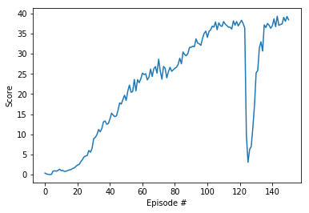

# Project 2 Report

## Motivation and Approach

Firstly, I applied Udacity's DDPG pendulum on the continuous control and got the result to be diverging. There were many instances of trial and error, at few it worked but the number of episodes in which it solved were pretty high. And then, I applied Udacity's DDPG bipedal walker which solved the environment within 500 episodes. But the number of episodes didn't seem to decrease, with trials of hyperparameter tuning. Then, I thought of merging Bipedal walker code and pendulum code, as the main aim of continuous control is to both actions and similar to the mixing both of the sceranrios. This led to making my ddpg agent from pendulum and my actor-critic models from bipedal. Below, I have explained my actor-critic models briefly.

## Learning Algorithm

In this project, we apply the Deep Deterministic Policy Gradients ([DDPG](https://arxiv.org/abs/1509.02971)) learning algorithm to solve the Reacher environment. DDPG is an off-policy model-free algorithm that uses neural networks to learn policies, even in high-dimensional and continuous action spaces. The implementation is 20 copies of a DDPG agent with 2 fully connected layers: hidden layers of 256 and then 256 units, each with ReLU activation, and an output layer of 4 units with tanh applied in order to bound the output between -1 and 1. That was the actor network specifically. 

The critic network has 3 fully connected layers: hidden layers of 256, 256 and then 128 units, each with Leaky ReLU activation, and an output layer of 1 unit, except that tanh is not applied to the output layer and the action vector is included between the first and second hidden layers. The hyperparameters are as follows:

| Hyperparameter | Value |
| ------------- | ------------- |
| replay buffer size | 1e5 |
| batch size | 128 |
| discount factor (gamma) | 0.99 |
| tau* | 1e-3 |
| actor learning rate | 1e-4 |
| critic learning rate | 1e-3 |
| number of episodes | 1000 |
| max time steps per episode | 1000 |
| L2 weight decay | 0 |

*Tau is the percentage of weights from the local model to carry over to the target model during the soft update of target parameters; meanwhile, `1 - tau` is the percentage of target model weights to carry over. 

## Plot of Rewards

The plot below shows that, after 151 episodes, the agent is able to receive an average reward of 30 over the last 100 consecutive episodes.

## Ideas for Future Work

Ideas for improving the agent's performance are as follows:
- Attempt prioritized experience replay, TRPO, TNPG, PPO, or D4PG.
- Solve the environment in fewer than 150 episodes.
- See how large the rewards can get before the environment is solved (do not stop at 30).
