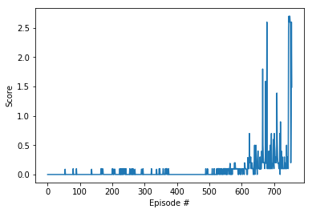

# Project 3 Report

## Learning Algorithm

## Why this algorithm?

We use DDPG as in the earlier classes, we have learnt DDPg works well when doing parallel processing. This problem is basically just and expanse version of parallel processing with some new twist. So,we also make few modifications in our DDPG agent, we try to work it for num of agents.

In this project, we use the Deep Deterministic Policy Gradients ([DDPG](https://arxiv.org/abs/1509.02971)) learning algorithm to solve the Tennis environment. DDPG is an off-policy model-free algorithm that uses neural networks to learn policies, even in high-dimensional and continuous action spaces. The implementation has two DDPG agents with actor and critic networks. Each agent uses the same actor network to take an action, sampled from a shared replay buffer.

## Did we use replay buffer, epsilon-greedy, etc approaches? (Also are both agents sharing same experience buffer or different)?

Yes, we use replay buffer, as mentioned in the ddpg_agent.py. We use same experience buffer for both the agents.

## Is the noise added to agents?

Here, is the main change from the conventional DDPG pendulum code, we add separate noise to both the agents. In this, we apply OUNoise to both agents separately. In order to make both the agents have different as if they are performing independently.

## Why do we choose the particular model architecture for Actor/Critic?

In this agent, we have to solve MARL, so I used the basic bipedal code while adding Batch Normalization to make it more faster, so that it can perform more efficiently. I initially just added normal fc layers like 128 and 64 and after some changes I arrived at the below architecture. Trial 4 is bipedal actor/critic model, it gave us the result of 865 epsiodes.

## Actor
State --> BatchNorm --> 128 --> ReLU --> 64 --> ReLU --> BatchNorm --> action --> tanh

## Critic
State --> BatchNorm --> 128 --> Relu --> 64 --> Relu --> action.

| Hyperparameter | Value |
| ------------- | ------------- |
| replay buffer size | 1e6 |
| batch size | 1024 |
| discount factor (gamma) | 0.99 |
| tau* | 1e-3 |
| actor learning rate | 1e-4 |
| critic learning rate | 1e-3 |
| number of episodes | 3000 |
| L2 weight decay | 0 |

*Tau is the percentage of weights from the local model to carry over to the target model during the soft update of target parameters; meanwhile, `1 - tau` is the percentage of target model weights to carry over.

## Why do we choose these particular hyperparameters ?

Initial parameters like tau, replay buffer size, discount factor, learning rates (LR) of actor and critic and L2 weight decay are taken from Udacity DDPG Pendulum code with no changes, but we make change in Batch size and make it bigger from 128 to 1024 because I thought less number of agents can try to model more from more batch size, thereby consuming less time. And we also perform few trial runs with change in tau, LR, batch size and noise.

## Results

| Trial | # of Episodes to Solve | Description | Comments |
| ------------- | ------------- | ------------- | ------------- |
| Initial Run | 756 | Default params with tau 1e-3, batch size 1024, and critic LR 1e-3 | Change in tau |
| Trial 2 | 789 | Tau 1e-1 | Not better than Initial Run |
| Trial 3 | 1034 | Tau 3e-1 and critic LR 1e-4 | Better than Initial Run |
| Trial 4 | 865 | Actor and Critic models without Batch norm, and also adding leakyReLU in critic method AND fc units from 128, 64 to 256 AND also tau= 1e-3 and critic lr = 1e-3 and buffer size = 1e5 | Better than Trial 3 |
| Trial 5 | 1284 | Going back to original model with Gaussian noise| Worst results thus far |
| Final Run | 756 | Default params with tau 1e-3, batch size 1024, and critic LR 1e-3 | Verifying Initial Run performs best |

## Plot of Rewards

The plot below shows that, after 756 episodes, the agent is able to receive an average reward of 0.5 over the last 100 consecutive episodes.

Trial 2 did pretty awesome job 

## Ideas for Future Work

Ideas for improving the agent's performance are as follows:
- Attempt prioritized experience replay and D4PG.
- Add lots of noise at the beginning and then reduce or remove it completely after a certain number of episodes.
- Try to solve it within 500 episodes.
- Implement TRPO and MAPPO
- Try a variation with: separate actors, one shared centralized critic, and a shared replay buffer.
